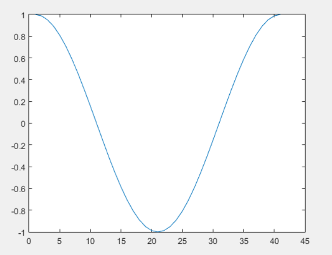
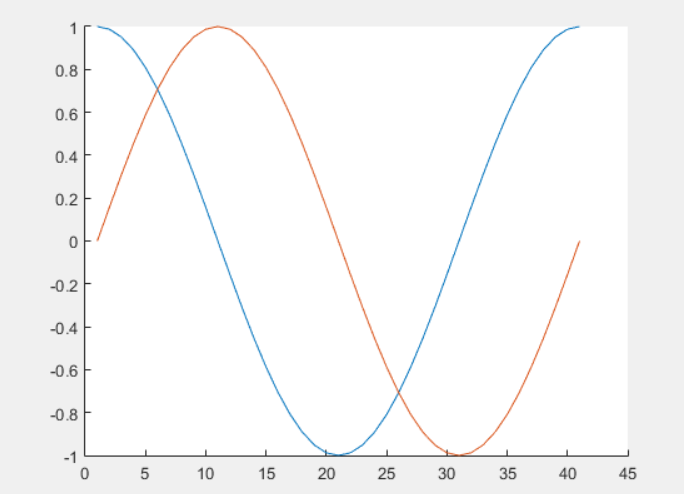
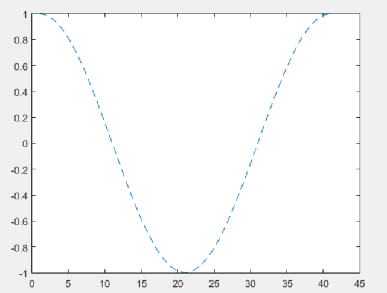
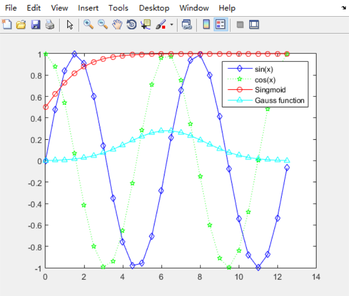

# 05_初阶绘图

## § 数据绘制

+ Matlab不能直接处理函数；

> 对于matlab来说，像f(x)=sin(2πt)这样的函数表达式Matlab是不理解的；matlab只会理解若干个点连接成图像；

+ 策略
    + 产生一个函数在一定范围内的数值；
    + 通过图像的方式来表示这些“点”；

## § plot( )

+ plot(x, y)：绘制横坐标x，纵坐标为y的图
+ plot（y）：x默认为1~n整数，依次对应y值；（x=[1...n]，y=length[y]）

```matlab
plot(cos(0:pi/20:2*pi))
```



## §  hold on / hold off

+ 使用hold on来使所有的函数曲线保留在图像中；

```matlab
hold on
plot(cos(0:pi/20:2*pi))
plot(sin(0:pi/20:2*pi))
hold off
```



## § plot样式

+ plot(x, y, 'str')将会根据**str**的样式来绘制(x, y)图像，具体可参考matlab帮助手册（LineSpec）；

```matlab
plot(cos(0:pi/20:2*pi), '--')
```



## § legend( )

+  为所绘制函数标明图标；

```matlab
x = 0: 0.5: 4*pi;
y = sin(x);
h = cos(x);
w = 1./(1 + exp(-x));
g = (1/(2*pi*2)^0.5).*exp((-1.*(x - 2*pi).^2)./(2*2^2));
plot(x, y, 'bd-', x, h, 'gp:', x, w, 'ro-', x, g, 'c^-');
legend('sin(x)', 'cos(x)', 'Singmoid', 'Gauss function');
```

