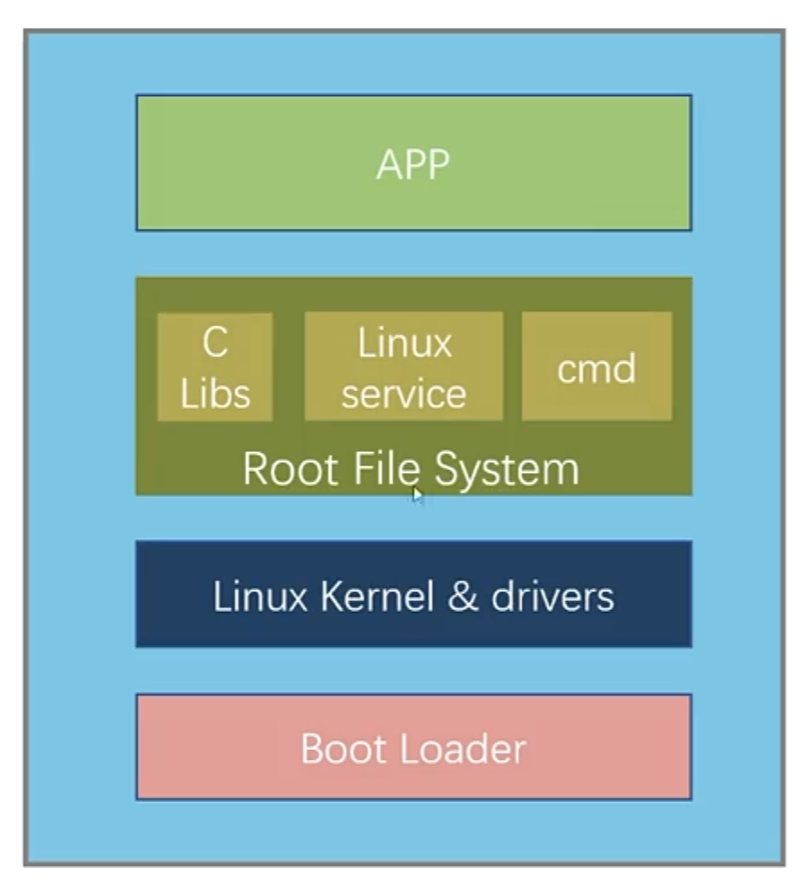
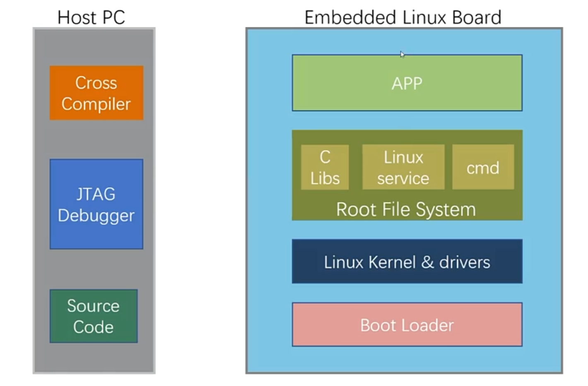
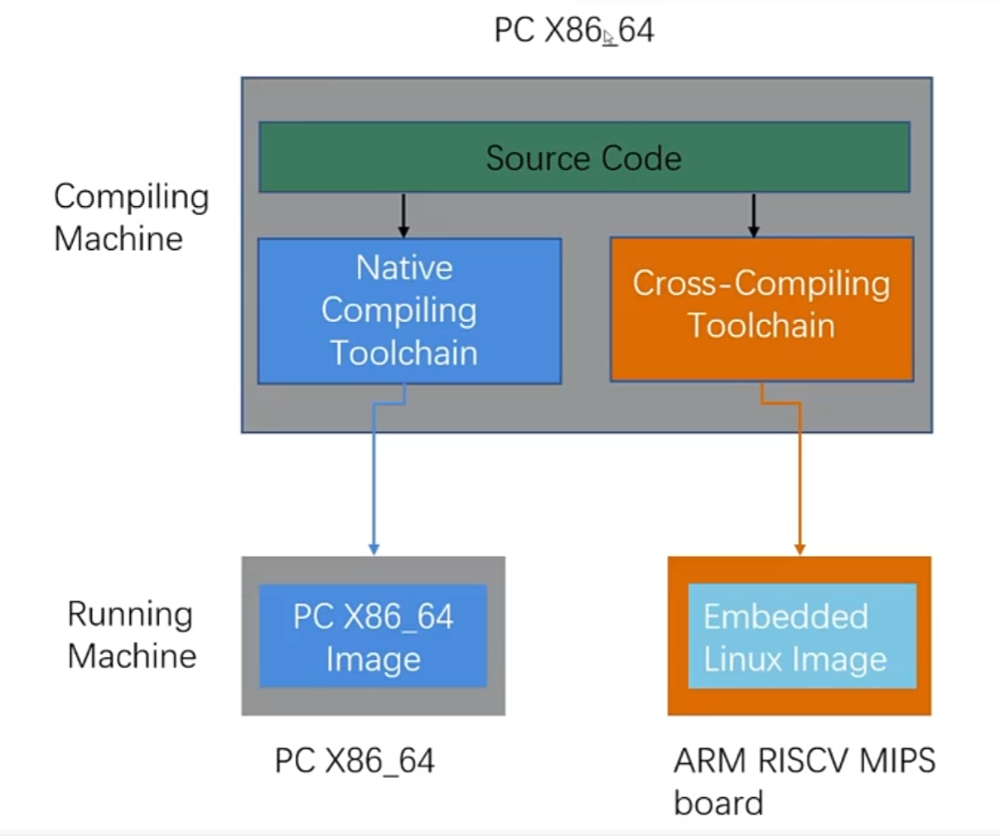
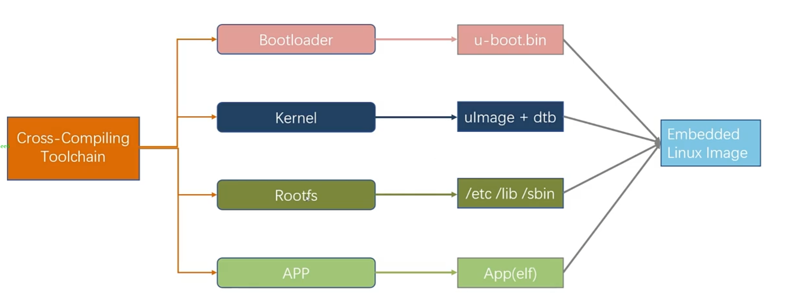
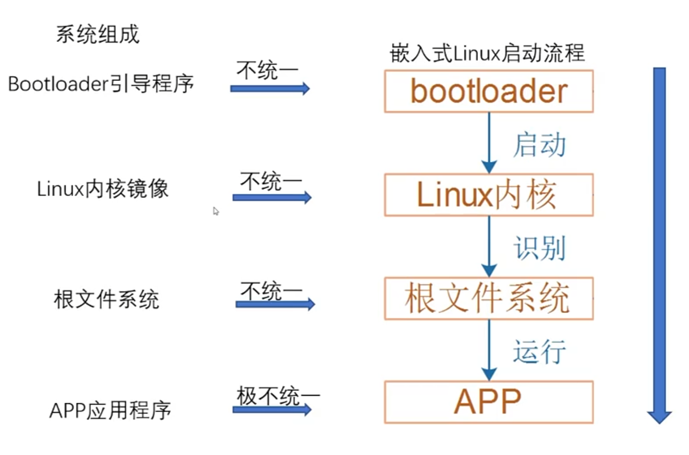
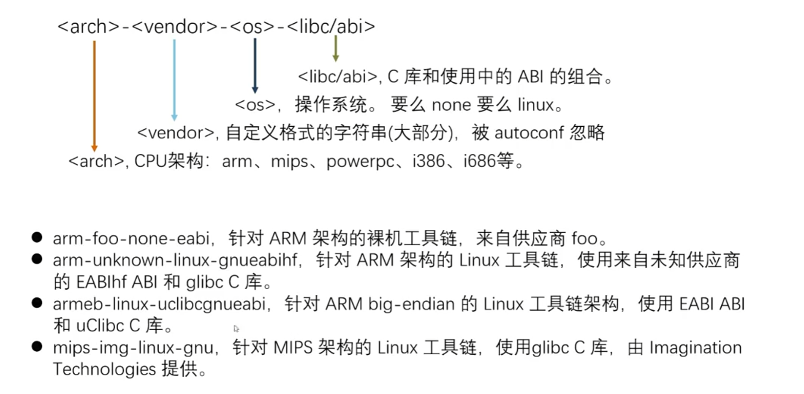

# 嵌入式系统组成与交叉编译工具链

## 1.Linux系统组成

+ Linux系统组成如下所示

+ 嵌入式Linux系统组成

主要区别在于嵌入式linux系统板算力较差，需要在算力比较强的设备上进行代码开发、编译；因为编译后的软件最终运行在ARM、MIPS架构的芯片上，与常用的PC架构（X86）不同，因此需要交叉编译工具链。

+ 构建编译环境

+ 嵌入式系统构建

将嵌入式中bootloader、kernel、rootfs、app分别构建完成后打包组成嵌入式镜像，组成一个完整的嵌入式系统。

+ 嵌入式Linux系统启动流程

## 2.交叉编译工具链

+ 什么是工具链

工具链是一组编程工具，用于开发软件、创建软件产品。通常，工具链有多个工具，前一个工具输出的结果，是下一个工具的输入，也就是说前一个工具处理完、再交给下一个工具处理。

一个简单的工具链可能由三部分组成：

	1. 编译器和链接器：将源代码转换为可执行程序。
	1. 库：为操作系统提供接口。
	1. 调试器：用于测试和调试创建的程序。

+ 什么是交叉编译器

在平台A上使用交叉编译器生成程序，这个程序可以在平台B上被运行。

+ 构建系统组成

1. build：构建机器，使用GCC的源码，制作交叉编译工具链。（制造工具）
2. host：主机，使用交叉编译工具链，编译出程序。（使用工具创造产品）
3. target：目标机器，程序执行的地方。（使用产品）

+ 工具链名称组成

+ 什么是SDK

SDK：software development kit，一个工具链，加上一些（可能很大）为Target目标架构构建的库头文件，以及在构建软件时有用的其他本地软件。

+ Yocto Build、Buildroot等构建系统的功能是什么

1. 使用现有工具链作为输入，或构建自己的工具链；
2. 除了生成根文件系统之外，它们还可以生成SDK以允许应用程序开发人员为目标构建应用程序/库。