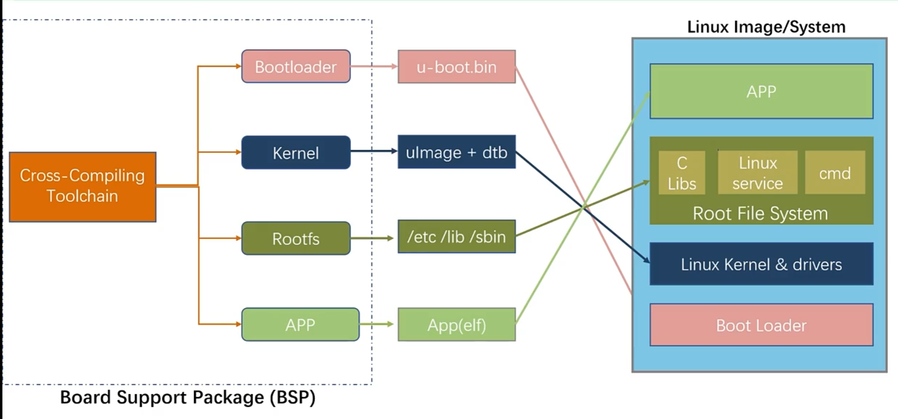
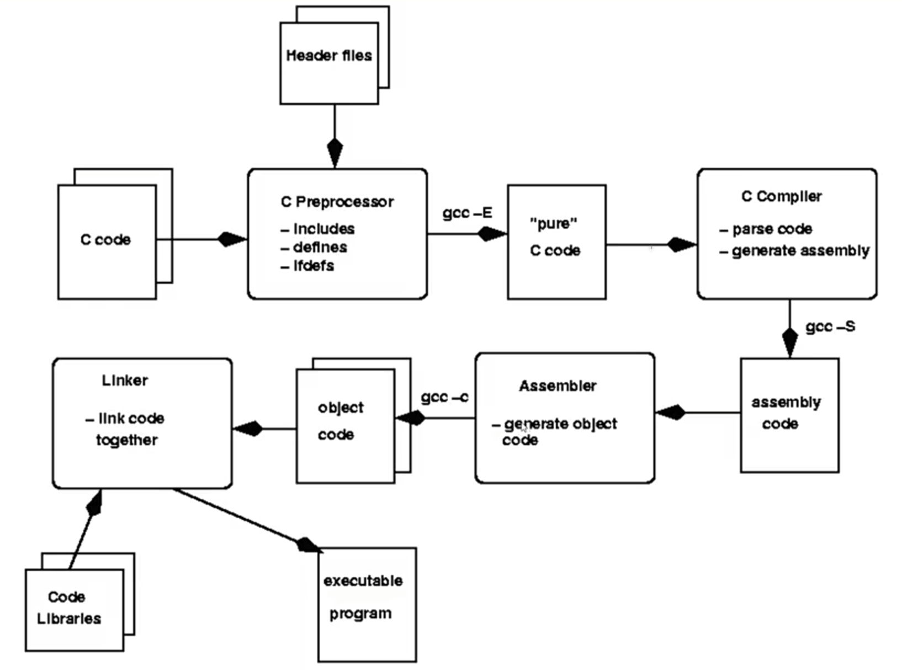

# 嵌入式常见编译框架与软件包组成

## 1.嵌入式开发准备工作

主芯片资料包括：

+ 主芯片资料
    + 主芯片开发参考手册；
    + 主芯片数据手册；
    + 主芯片规格书；
+ 硬件参考
    + 主芯片硬件设计参考资料；
    + 主芯片配套公板硬件工程；
+ 软件资料
    + BSP;
    + SDK;
    + 开发指南；

开发所需最少资源：

+ 开发板资料：

    + 开发板使用手册；
    + 开发板原理图；
    + 开发板规格书；
    + 开发板外围芯片数据手册；

+ 开发必要软件/源码：

    + 交叉编译工具链；
    + Bootloader源码/镜像；
    + LinuxKernel源码、镜像；
    + Rootfs根文件系统镜像、源码；
    + 打包工具；
    + 系统镜像烧录工具；

    Linux各部分组成与镜像对应关系;

    

## 2.常见编译框架

### 2.1GNU编译器编译过程

+ 预处理：pre-processing
+ 编译：compiling
+ 汇编：assembing
+ 链接：linking

### 2.2 Target和构建空间

+ 基础文件系统是由**BusyBox**和**C库**组成Target根文件系统的核心。

+ 在构建其它组件时，必须区分两个目录;
    + Target Space(目标空间)：包含目标根文件系统，应用程序执行所需的一些。
    + Build Space（构建空间）：包含比目标空间更多的文件，因为构建空间用于保存编译库和应用程序所需要的一切。所以至少保留头文件、二进制文件、配置文件。

### 2.3 可用的系统构建工具

+ Buildroot：由社区开发；
+ OpenWRT：最初是无线路由器Buildroot的一个分支，现在是一个更通用的项目；
+ PTXdist：由Pengutronix开发；
+ OpenEmbedded：更灵活也更复杂（工业化版本为Yocto）；

## 3.软件包组成

+ 开源组件
+ Target设备工具
    + 网络
    + 系统使用程序
    + 编程语言
    + 音频、视频和多媒体
    + 图形套件
    + 数据库
    + 网络浏览器
+ 嵌入式系统构建语言