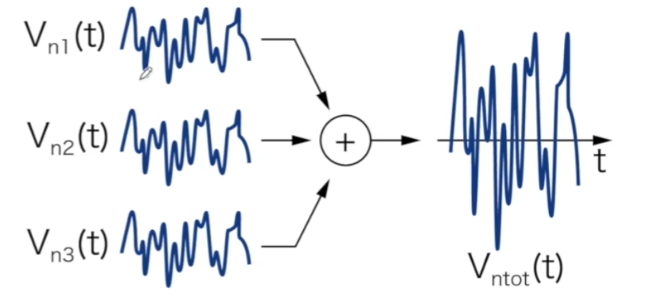

# 电路噪声

## 1.电路噪声来源

+ 本征噪声：晶体管、电阻；
+ 外部噪声：电源、参考、偏置、衬底、串扰；

将电路的输入短接，理想情况下输出为0，但实际输出不为0，即为电路噪声。

## 2.噪声大小衡量方法

### 2.1 时域

Probability Desity Funciton，PDF，概率密度函数

使用**标准差**来评估时域噪声大小，-3Vstd~+3Vstd覆盖99.7%的噪声波动范围：

### 2.2 频域

Power Spectral Density，PSD，功率谱密度

使用功率谱时使用V^2，好处是V^2/R，可以忽略电阻的影响（单位电阻）。

有功率谱可以进一步计算**噪声均方根**电压Root-Mean-Square Voltage：

## 3.系统传输函数对噪声的影响

在下图中可以看出，一个噪声信号经过一个低通系统，时序波形上看变得更加平滑，频域的频带变窄。

对于输入、输出的噪声均方根，差别在于输出会多一个系统的模值的平方在里面：

## 4.噪声叠加计算

计算公式如下：

### 4.1 不相关噪声

两个（n个）噪声不相关，对于两个噪声乘积的积分在足够长的时间上积分为0，

计算公式如下，以三个为例（能量叠加）：

### 4.2 相关噪声

n个噪声之间有所关联，其中一个噪声信号会影响到另一个噪声信号。

计算公式如下，以三个噪声信号为例（幅度叠加）：

## 5.输出噪声与等效输入噪声

  如何评估以下两个电路的噪声等级？

A： Vsign_rms = 100mV, SNRa = 100mV/1mV = 100;

B:   Vsign_rms = 10mV, SNRb = 10/0.2 = 50;

因此，电路B的噪声要大于电路A的噪声；

> 在系统输出端测量得到的噪声为**输出噪声**，除以系统总增益后则算到输入端的噪声为**等效输入噪声**。

+ 多个级联电路噪声如何计算？

