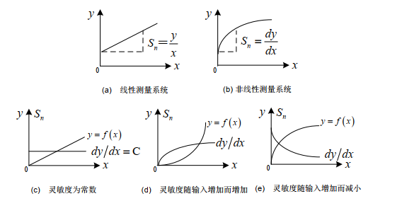

# 传感器基本特性

## 1.概述

+ 传感器的定义与组成：

    + 定义：能感受被测量并按照一定规律转换成可用输出信号的器件或装置。
    + 共性：利用物理定律或物质的物理、化学、生物等特性，将非电量转换为电量。
    + 功能：检测和转换。
    + 组成：

    

    > 敏感元件：传感器中能直接感受被测信息的元件。
    >
    > 转换元件：将敏感元件的感受信息转换成电信号的部分。

+ 传感器的分类：

    + 输入量：位移、速度、温度、压力等；
    + 输出量：模拟和数字；
    + 工作原理：应变式、电容式、电感式等；
    + 基本效应：物理型、化学型、生物型；
    + 构成：物性型与结构型；
    + 能量变换关系：有源、无源；

+ 传感器性能的改善：

    + 差动技术；
    + 平均技术；
    + 补偿与修正技术；
    + 屏蔽、隔离与干扰抑制；
    + 稳定性处理；

+ 传感器的集成化：

    + 具有同样功能的传感器集成化，即将同一类型的单个传感器元件用集成工艺在同一平面上排列起来，形成一维的线性传感器，从而使一个点的测量转变成对一个面或一个空间的测量；
    + 不同功能的传感器集成化，即将具有不同功能的传感器与放大、运算以及温度补偿等环节一体化，组装成一个器件，从而使一个传感器可以同时测量不同种类的多个参数；

## 2.传感器基本特性

### 2.1 静态特性

#### ① 线性度

+ 定义：传感器的输入、输出间成线性关系的程度；
+ 非线性的线性处理方法：

+ 非线性误差：

$$
\gamma_{L} = ±\frac{\Delta L_{max}}{Y_{FS}}
$$

$$
{\gamma_{L}——非线性误差（线性度）} \hfill \\
\Delta L_{max}——输出平均值与你和直线间最大偏差绝对值\hfill \\
Y_{FS}——满量程输出\hfill
$$

#### ② 灵敏度

传感器在稳态信号作用下输出量变化对输入量变化的比值；

#### ③ 分辨率

分辨率是指传感器能够感知或检测到的最小输入信号增量。分辨率可以用增量的绝对值或增量与满量程的百分比来表示。

#### ④ 迟滞/回程误差

+ 定义：在相同测量条件下，对应于同一大小的输入信号，传感器正、反行程的输出信号大小不相等的现象。

+ 产生原因：传感器**机械部分**存在摩擦、间隙、松动、积尘等；
+ 回程误差;

$$
\gamma_H = ±\frac{\Delta H_{max}}{Y_{FS}}
$$

#### ⑤ 重复性

传感器在输入量按同一方向做全量程多次重复测试时所得输入-输出特性曲线一致的程度。

$$
\gamma_R = ±\frac{\Delta R_{max}}{Y_{FS}}
$$

#### ⑥ 漂移

+ 定义：传感器在输入量不变的情况下，输出量随时间变化的现象；
+ 产生原因：
    + 传感器自身结构参数老化；
    + 测试过程中环境发生变化；

### 2.2 动态特性

#### ① 一阶传感器的频率响应

一阶传感器的微分方程为
$$
a_1 \frac{dy(t)}{dt} + a_0y(t) = b_0x(t)
$$
可改写为：
$$
\tau\frac{dy(t)}{dt} + y(t) = S_nx(t)
$$
其中，
$$
\tau——传感器时间常数（具有时间量纲） \hfill \\
S_n——传感器灵敏度（S_n只起到使输出增加S_n倍的作用，方便起见，令S_n = 1）\hfill \\
$$

+ 传递函数

$$
H(S) = \frac{1}{\tau s+1}
$$

+ 频率响应特性

$$
H(j\omega) = \frac{1}{\tau{j\omega}+1}
$$

+ 幅频特性

$$
A(\omega) = \frac{1}{\sqrt{1+(\omega\tau)^2}}
$$

+ 相频特性

$$
\phi(\omega) = -arctam(\omega\tau)
$$

#### ② 一阶传感器的动态标定

一阶传感器的单位阶跃响应函数为
$$
y(t)=1-e^{-\frac{t}{\tau}}
$$
定义并整理;
$$
z = ln[1-y(t)]=-\frac{t}{\tau}
$$
即z与t成线性关系，且有
$$
\tau = \frac{\Delta t}{\Delta z}
$$
因此，只要测量出一系列的t与y(t)的对应关系，即可求出\tau。

#### ③ 二阶传感器的频率响应

+ 传递方程

$$
H(S)=\frac{\omega^2_n}{s^2+2\zeta\omega_ns+\omega^2_n}
$$

+ 频率响应特性

$$
H(j\omega)=\frac{1}{[1-(\frac{\omega}{\omega_n})^2]+2j\zeta\frac{\omega}{\omega_n}}
$$

省略，参考二阶系统一致；

#### ④ 二阶传感器动态标定

参考二阶系统；

#### ⑤  共振现象

工作频率捷俊无阻尼固有频率时，系统发生共振，幅频特性受阻尼系数影响较大。为了避免此情景，在传感器设计时，必须使其阻尼系数远远小于1，固有频率wn至少应大于被测信号频率的2~3倍。