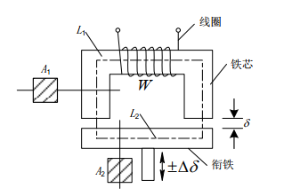
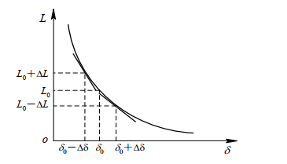
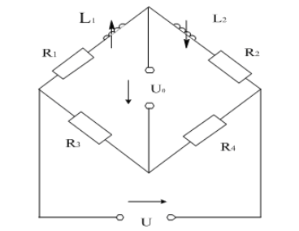

# 电感传感器

## 1.概述

+ 工作基础：电磁感应，即利用线圈自感或互感的改变来实现非电量测量。
+ 工作原理：
    + 被测物理量（非电量：位移、振动、流量）；
    + 线圈自感系数L/互感系数M；
    + 电压或电流（电信号）；
+ 分类：变磁阻式、变压器式、涡流式；

## 2.变磁阻式传感器

+ 工作原理

变磁阻式传感器由线圈、铁芯和衔铁三部分组成；铁芯和衔铁由导磁材料制成。

在铁芯和衔铁之间有气隙，传感器的运动部分（相对）与衔铁相连。当衔铁移动时，气隙厚度发生改变，引起磁路中磁阻变化，从而导致电感线圈的电感值变化，因此只要能够测出电感量的变化，就能确定衔铁位移量的大小和方向。
$$
L=\frac{W^2}{R_m}=\frac{W^2\mu_0A_0}{2\delta}
$$
上式表明：当线圈匝数为常数时，电感L仅是磁路中磁阻Rm的函数，改变气隙和气隙面积均能导致电感变化；变磁阻式传感器又可分为变气隙厚度传感器、变气隙面积传感器，主要使用变气隙厚度传感器。

+ 变气隙是传感器的电感—气隙特性：

当衔铁处于初始位置时，初始电感量为：
$$
L_0 = \frac{\mu_0A_0W^2}{2\delta_0}
$$
经线性处理后（泰勒级数展开），有：
$$
\frac{\Delta L}{L_0} = \frac{\Delta \delta}{\delta_0}
$$

+ 灵敏度

$$
K_0 = \frac{\frac{\Delta L}{L_0}}{\Delta \delta} = \frac{1}{\delta_0}
$$

实际使用中，传感器灵敏度设计完成后即为确定值，可通过调节放大电路来调节整体的灵敏度。

## 3.电感式传感器的测量电路——交流电桥式

把传感器的两个线圈作为电桥的两个桥臂Z1和Z2，另外两个相邻的桥臂选用纯电阻。当衔铁上移时，设有：
$$
Z_1 = Z_0 + \Delta Z_1 \\
Z_2 = Z_0 - \Delta Z_2 \\
Z_0 = R + j\omega L_0
$$
对于高Q值的差动电感式传感器，有：
$$
\Delta Z_1 = j\omega \Delta L_1 \\
\Delta Z_2 = j\omega \Delta L_2 \\
Z_0 = j\omega L_0 
$$

> 什么是传感器的“高Q值”？
>
> 传感器的“高Q值”指的是其质量因子（Quality Factor，Q值）较高。在传感器领域，Q值是一个重要的性能指标，用来描述传感器在特定工作条件下的性能优劣。
>
> 1. **定义和意义**：
>    - Q值反映了传感器在特定频率或工作条件下的能量损耗和能量存储能力的比例。具体来说，它是传感器的能量存储能力与能量损耗速率之比。Q值越高，表示传感器在接收到信号后能够长时间保持振荡或响应，而不会因为能量损耗而减弱或衰减得太快。
>
> 2. **影响因素**：
>    - Q值受到多种因素的影响，包括传感器的构造设计、材料选择、工作频率等。优化这些因素可以提高传感器的Q值。
>
> 3. **应用和优势**：
>    - 高Q值的传感器通常具有更高的灵敏度和准确性。它们能够更有效地检测和响应目标信号，减少噪声干扰的影响，因此在精密测量、通信系统和探测器等应用中特别有用。
>
> 4. **实际案例**：
>    - 例如，在无线电频率识别（RFID）系统中，高Q值的天线可以更有效地与标签通信，提高识别距离和速度。
>    - 在振动传感器中，高Q值可以提高传感器对微小振动信号的捕捉能力，用于结构健康监测等领域。
>

此时，电桥的输出电压为：
$$
\dot{U_0} = \dot{U_1}[\frac{Z_2}{Z_1 + Z_2}-\frac{R}{R+R}] = \dot{U_1}\frac{Z_2-Z_1}{2(Z_1+Z_2)} = -\dot{U_1}\frac{\Delta Z_1 + \Delta Z_2}{2(Z_1+Z_2)}
$$
对于差动结构，则有：
$$
\dot{U_0} = -\frac{\dot{U_1} \Delta \delta}{2\delta_0}
$$
可见，电桥输出电压与气隙厚度变化成反比。